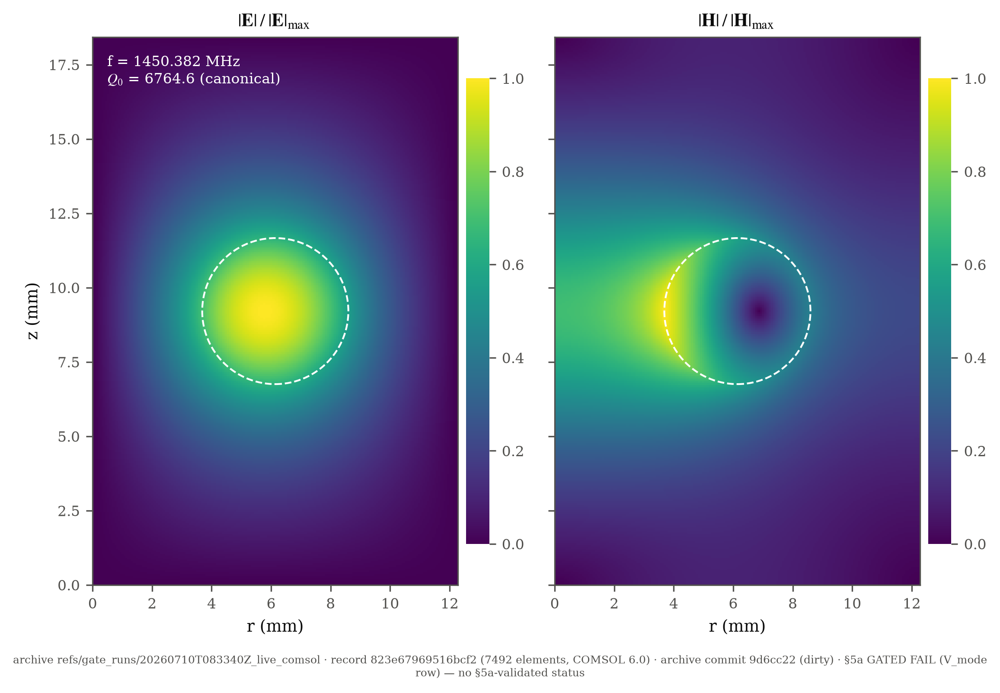
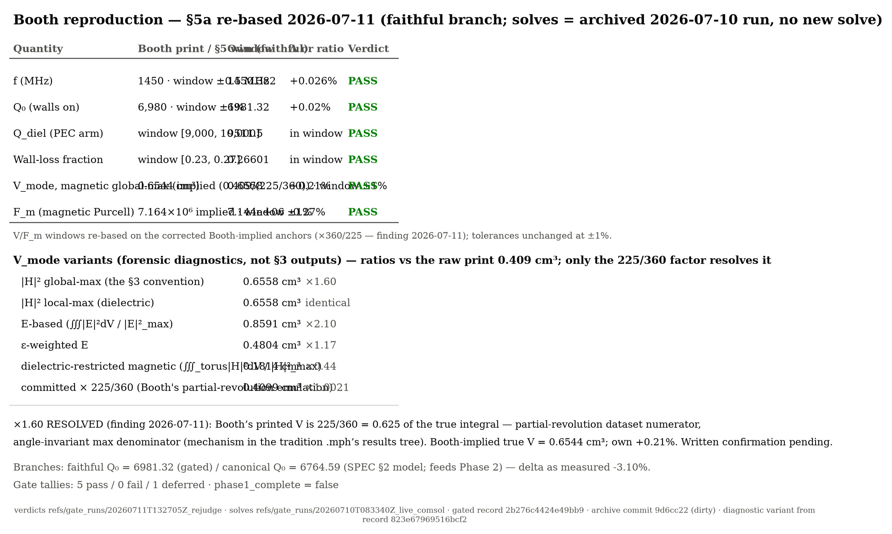
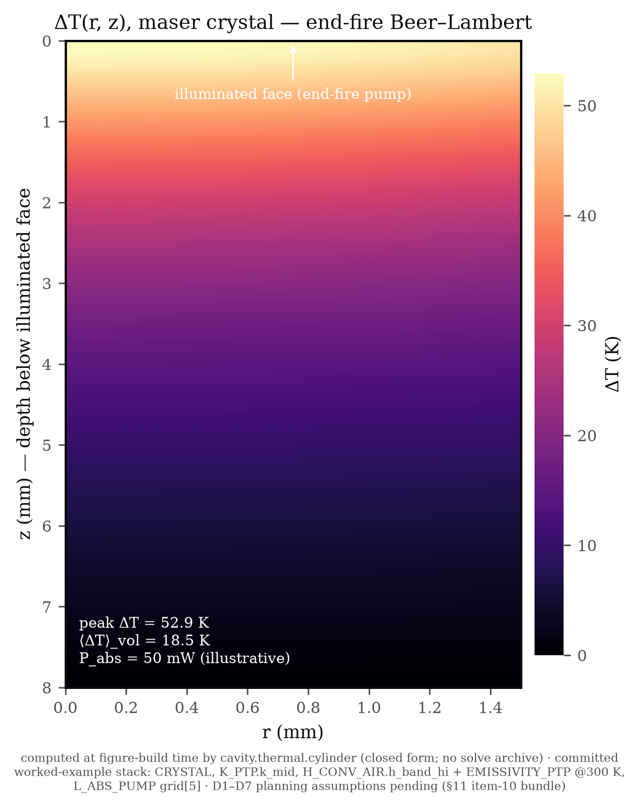
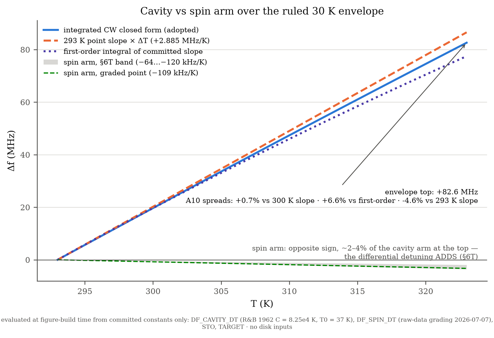
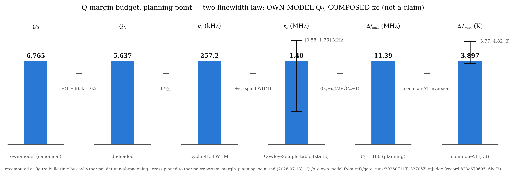
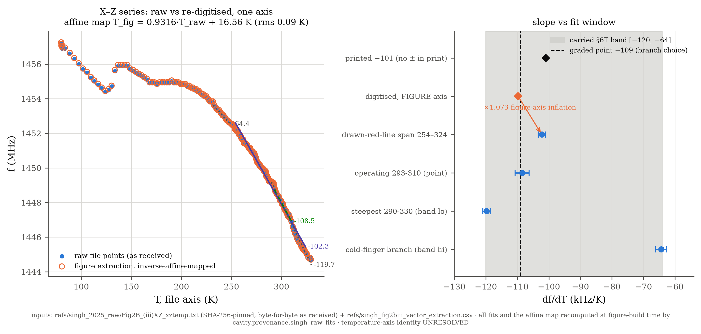

# Supervisor one-pager — STO TE01δ maser cavity, status at 2026-07-13

**Scope of this artifact:** six figures rendered from EXISTING committed records (the archived §5a run and its 2026-07-11 re-based gate record `refs/gate_runs/20260711T132705Z_rejudge/`, the byte-pinned margin report machinery, the SHA-256-pinned Singh raw archive, and the committed §6T/§7T constants) plus this summary — no new solves; the one derivation-level change is the 2026-07-13 two-linewidth re-base of the §7.T4 margin law (see F5 and ask 7). Captions are committed constants (`src/cavity/figures/`) and appear here verbatim; every applicable SPEC status flag rides in its caption. Regenerate with `python -m cavity.figures`; pinned in `tests/test_figures.py`.

## What was built

The validated §8 analytic benchmark (empty-cavity TE011 + PEC/lossy Q-convention anchor) gates a COMSOL forward model (§2: axisymmetric eigensolve, mode identified by field symmetry, raw complex eigensolutions persisted) with Jacobian-explicit §3 extraction, the §4 wall-loss decomposition, and the §5/§5a gate machinery. On the thermal side: the licence-free closed-form conduction submodel (§7T — layered/Hankel rig anchor and Bessel/Robin maser-cylinder anchor, with the §7.T7 radiation composition), the §7.T2 output-3 line observable, and the §7.T4 detuning budget maps with one planning point evaluated. Everything numeric is single-sourced through the graded provenance constants (§6/§6T) and regression-pinned in CI. New 2026-07-13: the §7.T4 detuning-margin law is re-derived as the two-linewidth pulled-oscillator threshold Δf_max = ((κc+κs)/2)√(C₀−1) — the earlier (κc/2)√(C₀−1) is its κs → 0 limit — with κs graded from the Cowley-Semple linewidth table and the committed turnover map (`thermal/reports/q_margin_turnover.md`) replacing the bare −1/2 exponent.

## What the §5a checkpoint shows (2026-07-10 live COMSOL run; re-based 2026-07-11, no new solve)

The recovered Booth torus geometry (`refs/booth_geometry_recovery.md`) is empirically supported: f correct to 4 s.f. and Q₀ within +0.02% of Booth's 6,980. The run solves two material branches: the .mph-exact faithful branch carries the gate (tanδ = 1.054×10⁻⁴; Q₀ = 6981.3, F2's headline rows), the SPEC §2 canonical branch carries the model (tanδ = 1.1×10⁻⁴; Q₀ = 6764.6, stamped in F1's panel, feeding Phase 2 and now the margin report's own-model headline) — the two Q₀ values across adjacent figures are branch discipline, not an inconsistency (branch delta as measured −3.10%). The 2026-07-10 run's V_mode FAIL (×1.60 Booth's printed 0.409 cm³) is **RESOLVED**: her printed mode volumes are 225/360 = 0.625 of the true integral — the mode-volume numerator in her results tradition was evaluated on a Revolution-2D dataset left at COMSOL's default 225° partial revolution, while the max-denominator is angle-invariant (mechanism read from the tradition `.mph`'s results tree; her Table 8 is internally consistent row-by-row, the factor is uniform, and her comparative conclusions survive intact). Corrected, the Booth-implied true V_mode is 0.6544 cm³ vs our 0.6558 — **+0.21%** — and the archived record re-judges **GREEN under the unchanged ±1% tolerance** (window basis re-derived per §11 item 8; F_m tightened from an order-of-magnitude window to ±1% consistency, PASS at −0.27%). Tallies 5 pass / 0 fail / 1 deferred (confinement — a Breeze-side §7 sweep); `phase1_complete` remains false on that deferred row. Booth-side written confirmation of the mechanism is pending (findings note drafted, ask 6).

## What W2 found (added 2026-07-22 — the Wu-anchor dual-geometry session; archive `refs/gate_runs/20260722T144737Z_wu_anchor_w2/`)

The first solve of the Phase 1b **Wu-ring model** (STO ring + polystyrene seat + pentacene:p-terphenyl crystal in the bore — the crystal sub-domain was built this session as the ratified precondition) against the pre-committed W2 acceptance windows, run as **two geometries in one session** because the ring O.D. is currently double-valued (Wu 2020 prints 12.0 mm; our 2026-07-21 in-person caliper read 12.2 mm — written confirmation pending): Run A at the **print** O.D. carried the gates, Run B at the **measured** O.D. was diagnostic only, and the protocol (including this split) was committed before any solve ran. **Run A passed every gated row**: the mode-volume convention check first (local/global = 1.058, within the 10 % window — the 225/360 lesson applied prospectively), then f = 1431.19 MHz (−1.26 % vs the printed 1.4495 GHz, inside the ±1.5 % window; the residual is NOT fully attributable to the εr spread [312, 318] — at our measured sensitivity −2.26 MHz/unit, εr alone reaches at most 1440.9 MHz — stated as-is), and Q₀ = 7152 vs the printed 7200 (−0.67 %; the Q₀ = 2Q_L de-load uses Wu's own stated k = 1). The mode volume lands at 0.349 cm³ against the paper's 0.32 cm³ (+9 %, report-only — the SM prints no convention). The diagnostic run puts a number on the O.D. stake: **−88.3 MHz per mm of O.D.**, so the 0.2 mm print-vs-caliper discrepancy is worth −17.7 MHz — and the printed anchors sit decisively nearer the *print* geometry (residual −18.3 vs −36.0 MHz). No branch was selected: the measured value minted nothing, and the which-O.D. question rides the confirmation email with the sensitivity now attached. This record is the **Wu anchor**, and the Layer-A sweep centre definition now has its concrete referent (`cavity.sweep.wu_anchor`, record `b8895aa479464763`).

## What is blocked on what

- **Own-model margin rebase** — DONE 2026-07-11 (the V_mode resolution unblocked it): F5 and the margin report now headline the own-model canonical Q₀ = 6,764.6 (κc still COMPOSED with Breeze's k = 0.2 — Booth states no coupling).
- **Two-linewidth margin re-base** — DONE 2026-07-13 (the §7.T4 law re-derived with κs; planning margin 1.77 → 11.39 MHz, 0.60 → 3.90 K; direction margin-favourable). **Headline use ← Oxborrow ratification** (ask 7; findings note drafted).
- **Observable-b prediction runs** ← Phase 1b (bore + crystal) + Angus rig metadata (§11 item 5).
- **Claim levels** ← the ratification bundle (D1–D8, w_s; §11 item 10).

## Figures

**F1.** TE01δ mode maps at the recovered Booth torus: |E| (left) and |H| (right) over the (r, z) half-plane, each normalised to its own maximum (eigenmode amplitude is arbitrary); copper box and dielectric torus cross-section outlined. Rendered from the archived §5a finest-mesh walls-on SolveRecord, CANONICAL branch (SPEC §2 materials: εr′ = 316.3, tanδ = 1.1×10⁻⁴; record `823e67969516bcf2`, 7492 elements, `refs/gate_runs/20260710T083340Z_live_comsol`): f = 1450.382 MHz, Q₀ = 6764.6. Mode identified by field symmetry (azimuthal-E energy fraction 1.00, zero on-axis H_z sign changes), not eigenvalue order. The gated FAITHFUL companion (tanδ = 1.054×10⁻⁴, the .mph-exact unrounded Debye value) gives Q₀ = 6981.3 vs Booth's 6,980 (+0.02%); branch delta −3.10% as measured. The §5a gate is GREEN as re-based 2026-07-11 — the V_mode row's ×1.60 resolved as Booth's 225/360 partial-revolution print factor (see F2; record `refs/gate_runs/20260711T132705Z_rejudge`): 5 pass / 0 fail / 1 deferred, `phase1_complete` still false on the deferred confinement row.

**F2.** Booth reproduction at the recovered TE01δ torus (`refs/booth_geometry_recovery.md`), §5a re-based 2026-07-11 (re-judgment record `refs/gate_runs/20260711T132705Z_rejudge`; solves from the immutable 2026-07-10 archive `refs/gate_runs/20260710T083340Z_live_comsol`, gated record `2b276c4424e49bb9` — no new solve): own-model values on the FAITHFUL material branch (tanδ = 1.054×10⁻⁴, the .mph-exact unrounded Debye value, `BOOTH_MPH_TAN_DELTA`) judged against the re-based §5 windows — ALL LIVE-JUDGED ROWS PASS. The 2026-07-10 V_mode FAIL (×1.60) is RESOLVED: Booth's printed 0.409 cm³ is 225/360 = 0.625 of the true integral — her mode-volume numerator was evaluated on a Revolution-2D dataset left at COMSOL's default 225° partial revolution while the max-denominator is angle-invariant (mechanism read from the tradition .mph's results tree, `refs/comsol/booth/2D Resonator Lossy.mph`; anapole model in hand, TE01δ row by uniform-workflow inference; Booth-side written confirmation PENDING — `docs/booth_vmode_findings_note.md`). Corrected, the Booth-implied true V_mode = 0.409/0.625 = 0.6544 cm³ vs own-model 0.6558 — +0.21%, PASS inside the UNCHANGED ±1% tolerance (window BASIS re-derived per §11 item 8, never widened); her Table 8 is internally consistent per row, the factor is uniform, and her comparative conclusions survive intact. F_m re-scoped (a TIGHTENING): the Booth point now takes ±1% consistency vs the corrected Booth-implied F_m = 7.164×10⁶ (own 7.144×10⁶, −0.27%, PASS — the old order-10⁷ window there was satisfiable only through the inflated print and moves to the confinement endpoint, deferred). f (4 s.f.), Q₀ (+0.02% vs 6.98×10³), Q_diel and the wall-loss fraction PASS as before. The variant diagnostics (local-max identical; E-based 0.859 / 0.480 cm³; dielectric-restricted 0.181 cm³, from the same archived finest-level grid F1 loads) stand as the forensic record that no convention variant reproduces the raw print — only the 225/360 factor does (committed × 0.625 = 0.4099 ≈ 0.409). Branch discipline unchanged: gate-passage is a faithful-branch statement; the canonical companion (tanδ = 1.1×10⁻⁴, Q₀ = 6764.6, the SPEC §2 model Phase 2 runs — now the margin report's own-model headline) was never judged against the ±1% window; branch delta AS MEASURED −3.10%. Tallies 5 pass / 0 fail / 1 deferred (confinement trend — Breeze-side sweep); `phase1_complete` remains false on that deferred row: §5a benchmark PASS is not phase completion.

**F3.** Steady-state ΔT(r, z) in the maser crystal (Pc:PTP cylinder, radius 1.5 mm × height 8 mm; provenance `Crystal`), computed by the licence-free closed-form Bessel/Robin conduction anchor `cavity.thermal.cylinder` at the committed worked-example stack: END-FIRE axial Beer-Lambert deposition (D2 — supervisor-preferred, Oxborrow-verbal 2026-07-08; side-fire structurally outside the axisymmetric eigenbasis), l_abs = 200 µm (UNSOURCED-SCOPING value; nominal-doping arithmetic would overstate absorption — Oxborrow-verbal 2026-07-06), flood radial profile (D3), k = 0.316 W m⁻¹K⁻¹ (geometric mid of the 0.1–1 band; the 0.1 floor's provenance is a liquid-phase value), Dirichlet base ('substrate at room temperature') and Robin side/top at h = h_conv,hi + h_rad ≈ 25.5 W m⁻²K⁻¹ (free-convection ceiling — both real geometries likely sit below the 5–20 band — plus linearised radiation at ε = 0.90 of the ratified 0.80–0.95 band). P_abs = 50 mW is ILLUSTRATIVE: chosen so the volume-averaged ΔT ≈ 19 K sits inside Oxborrow's in-thread 'several tens of Celsius' inference (~13–30 K at 100 mA drive); ΔT is strictly linear in P — rescale freely. Peak ΔT ≈ 53 K at the illuminated face; at this ΔT the linearised h_rad under-reads the exact quartic by ~5–16% (§7.T7). Energy diagnostic: boundary flux = P_abs to solver truncation. All D1–D7 BC/heating details are parameterised planning assumptions pending Oxborrow (§11 item-10 bundle).

**F4.** Cavity-arm detuning over the ruled 30 K operating envelope, 293→323 K ('293 + 30 = 323' is our reading of the verbal 30 K ruling — Oxborrow-verbal 2026-07-08 — not his verbatim range). Three branches of the same §6T constant (Rupprecht & Bell Curie–Weiss parameters C = 8.25×10⁴ K, T₀ = 37 K; local-slope caveats and the 112 K validity floor as graded): the ADOPTED integrated closed form (`cavity.thermal.detuning`; +82.6 MHz at the envelope top), the 293 K point slope × ΔT (+2.885 MHz/K), and the first-order integral of the committed slope. Documented spreads (CI anchor A10): integrated = +0.7% vs the 300 K point slope × 30 K, +6.6% vs the first-order integral, −4.6% vs the 293 K slope × 30 K. The spin arm is drawn to the same scale at its §6T band (−64…−120 kHz/K; graded point −109 kHz/K, the conservative face-value branch): at the envelope top it reaches only ~2–4% of the cavity arm — that asymmetry is the point — and its sign is OPPOSITE (cavity blue-shifts, spins red-shift on heating), so the differential detuning ADDS. Spin-arm caveats ride along: the raw data's temperature-axis definition is UNRESOLVED (it IS the band), deuteration transfer unverified, local slopes only. p_e ≈ 1 assumed (gate-run p_e = 0.9977, a −0.2% correction inside the band).

**F5.** Thermal-margin budget at the planning point, regenerated through the same committed functions as the byte-pinned report (`thermal/reports/q_margin_planning_point.md`, re-based 2026-07-13, the two-linewidth threshold pass): Q₀ = 6,764.6 — OWN-MODEL, the canonical-branch walls-on finest value from the re-based §5a record (`refs/gate_runs/20260711T132705Z_rejudge`; supersedes the cross-build composite's Booth-print 6,980, now the comparison anchor) → Q_L = 5,637 under de-loading k = 0.2 (Breeze 2017; Wu's coupling unstated — flagged; Booth p. 8 states no coupling, so κc is COMPOSED, not fully own-model) → κc = f/Q_L = 257.2 kHz (CYCLIC-Hz FWHM, never the angular 2πf/Q_L — the provenance table's verified W20 angular-'Hz' trap) → κs = 1.40 MHz, the spin-line FWHM now entering the threshold (`KAPPA_S`; Cowley-Semple linewidth table, 0.1% d₁₄ branch choice; whiskers = the Pc:PTP band [0.55, 1.75] MHz; best-per-host at differing MW/laser powers — not a controlled comparison; STATIC planning branch — the κs(ΔT) feedback via the broadening machinery is the flagged follow-on, not implemented) → Δf_max = ((κc+κs)/2)√(C₀−1) = 11.39 MHz at C₀ = 190 (the SPEC revision-note planning value, never a measured constant; C₀ is IMPORTED, not recomputed from κs) → ΔT_max = 3.90 K, whiskers = the §6T coefficient band [3.77, 4.82] K at point-κs; combined κs × coefficient envelope ≈ 1.8–5.8 K. TWO-LINEWIDTH RE-DERIVATION (2026-07-13, external-review argument verified by independent derivation): the committed Δf_max = (κc/2)√(C₀−1) is the κs → 0 limit of the general pulled-oscillator law, and at this operating point (κc/κs ≈ 0.18, the far side of the κc ≈ κs turnover) the sign of the committed 1/√Q hypothesis inverts — the Q-margin exponent is ≈ +0.35, not −1/2 (`thermal/reports/q_margin_turnover.md`); the superseded law understated the margin ×6.4. BRANCH ATTRIBUTION: gate-passage is established on the FAITHFUL branch (Q₀ = 6,981.3, +0.02% vs Booth's 6,980); the canonical Q₀ has NOT itself passed the Booth window (branch delta −3.10% as measured). Riders: p_e = 0.99750 is the own-model walls-on canonical value (retires the PEC-anchor placeholder); the two arms compose under the common-ΔT planning convention D8 (direction conservative — overstates detuning, understates ΔT_max); the probe weight is a uniform-over-crystal placeholder, so spin-arm content inherits UNRATIFIED-w_s status doubly (gain mask = STO fallback until Phase 1b). The Q-margin QUESTION is supervisor-endorsed (verbal, 2026-07-06); the RESULT — including the sign-inversion finding — remains unratified (findings note drafted, not sent) — this is a planning point, not a claim.

**F6.** Provenance of the spin-arm coefficient: the Singh et al., Nat. Commun. 16, 10530 (2025) Fig. 2B(iii) X–Z series exists in two temperature axes related by an exact affine map, T_fig = 0.9316·T_raw + 16.56 K (rms 0.09 K; recomputed at render time by `cavity.provenance.singh_raw_fits` from the two committed point sets). Left: the raw point series (`refs/singh_2025_raw/`, byte-for-byte as received from the first author, SHA-256-pinned; plotted-point exports, not raw acquisition; 0.1 MHz quantisation) with window fits; overlaid, the 197 re-digitised figure points (`refs/singh_fig2biii_vector_extraction.csv`) mapped through the affine map — coincident at the quantisation floor. Right: slope vs fit window — the paper's printed −101 kHz/K agrees with its own raw data to ~1% (raw OLS −102.3 ± 1.1 over file-axis 254–324 K, the drawn red line's span; the paper prints no uncertainty anywhere), while the earlier digitised −112 kHz/K was a faithful reading of the FIGURE, whose axis inflates slopes ×1.073 — the printed-vs-digitised discrepancy is localised entirely to the figure/file axis boundary. Which axis carries the calibrated sensor reading is UNRESOLVED (top ask to the authors); that systematic IS the carried band [−1.2×10⁵, −6.4×10⁴] Hz/K (shaded), with the graded point −1.09×10⁵ Hz/K = the conservative face-value branch over 293–310 K — a documented branch choice, not a best estimate. Deuteration-transfer caveat retained (protonated Singh crystal vs the dataset's Pc-d₁₄:PTP-d₁₄).

## Asks

1. **First-paper boundary** — the boundary question from the 2026-07-06 framing note (which results belong to the collaboration's first paper vs this project's own writeup) is still pending a written reply.
2. **The Angus introduction** — committed Monday 2026-07-06 (reminder sent); the §11 item-5 metadata asks (per-sample form/thickness, rig + cw spot size, laser power at sample) route through it.
3. **D8 ratification** — the common-ΔT two-arms convention of the detuning integration (both arms at the crystal's probe-weighted mean ΔT; direction conservative, magnitude unmodelled).
4. **w_s projection ratification** — which spin-projection mode headlines observable-b (|H|² default, the Breeze-framework convention; UNRATIFIED).
5. **Lang temperature-window follow-up** — Lang 2007 Fig. 4 read locally at the ruled 293–323 K window (corroborates the cold-finger branch; local-fit discipline per §6T).
6. **Booth V_mode finding — confirmation** — the definition question is RESOLVED on our side (225/360 partial-revolution factor, read from the tradition `.mph`; SPEC §5a finding 2026-07-11); a findings note is drafted for your review (`docs/booth_vmode_findings_note.md`) with one discrimination question for you/Booth: does the results setup match recollection — Revolution-2D dataset at the default 225°?
7. **Q-margin two-linewidth re-derivation — ratification** — the committed Δf_max = (κc/2)√(C₀−1) is the κs → 0 limit of the linearised two-mode threshold with pulling; at our operating point (κc ≈ 257 kHz vs κs ≈ 1.4 MHz from the linewidth table) the 1/√Q hypothesis inverts sign (exponent ≈ +0.35) and the planning margin re-bases to Δf_max ≈ 11.4 MHz / ΔT_max ≈ 3.9 K. Findings note drafted for your review (`docs/q_margin_two_linewidth_findings_note.md`); the derivation and re-based numbers need ratification before headline use. This elevates the raw linewidth-table ask (item 5 riders): κs is now load-bearing — and adds one question: are the table's ODMR linewidths the right κs, or should Angus be asked for linewidths extrapolated to low MW/laser power?
8. **The Oxborrow confirmation email (owed; re-scoped 2026-07-23 after the standard-resonator email, `calibration/data/raw/oxborrow_std_resonator_2026-07-23/`)** — line items:
   (i) **Ring identity** — is the 12.2 mm O.D. / 8.6 mm-high standard ring the same physical ring as the Wu 2020 build's? The one remaining load-bearing gap: the 2026-07-23 email written-corroborates the VALUES at standard-resonator scope only; the identity claim is still Oxborrow-verbal.
   (ii) **Caliper band** — repeats / caliper placement for the 2026-07-21 readings (O.D. 12.2 mm, height 8.6 mm, travel [15, 25] mm); the 2026-07-18 spacer-dims caliper rider stays attached.
   (iii) **Piston-step gap depth** (standing rider; optional Q2 payload).
   (iv) **C₀ = 200 written confirmation** (standing; untouched by the 2026-07-23 email).
   (v) **I.D. 4.00-vs-4.05 disambiguation** — is the standard-resonator email's "4 mm inner diameter" the usual round of 4.05, or a genuinely 4.00 mm standard-build I.D.?
   (vi) **NEW rider — E-field export**: an E-field export from (or blessing to export from) the archived standard-resonator .mph, to retire the E-energy-weighting "assumed ≈ 1" on `DF_CAVITY_DT` (§8 gate-run p_e = 0.9977).
   Items (i)–(iv) narrow or persist; nothing closes silently.

*Process note (2026-07-21, Oxborrow-verbal — the standing format bar for the two-linewidth findings note and all future notes; notes archived at `calibration/data/raw/oxborrow_meeting_notes_2026-07-21/`): write-ups must be self-contained, with variables introduced properly — "put it in a form where he doesn't have to read my mind to understand what's going on." He is happy to check maths/ideas presented that way.*
